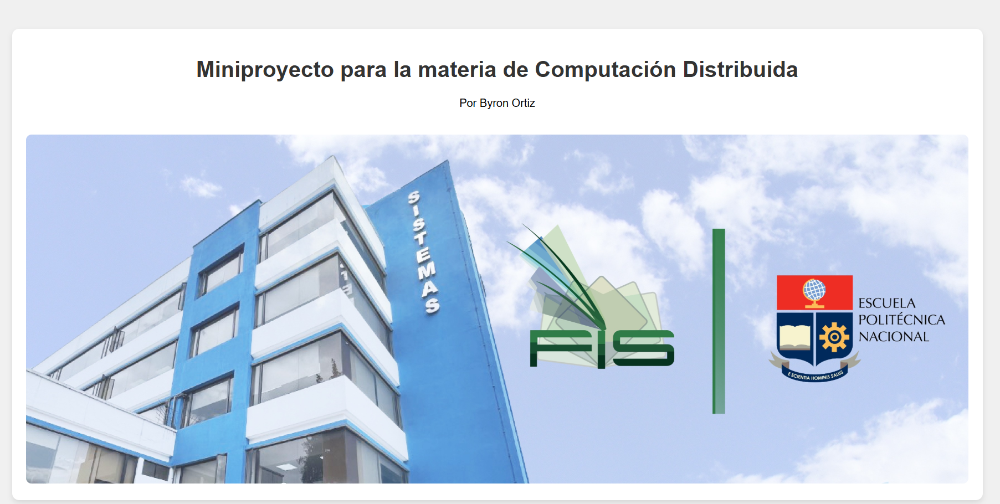

# Miniproyecto - Servidor Web en C

Proyecto para la materia de **Computación Distribuida**.
Por **Byron Ortiz**.

## ¿De qué trata?

Básicamente desarolle este servidor web chiquito en su version (HTTP/1.1) usando C en Linux
Este proyecto se maneja con una arquitectura event-driven usando `epoll` para admitir multiples clientes. 
Esto hace que el servidor pueda atender a varias personas al mismo tiempo (concurrencia) sin trabarse, parecido a como funcionan los servidores modernos.

## ¿Cómo hacerlo funcionar?

Seguir estos pasos en la terminal de su sistema operativo linux:

1. Escribe `make` y dale enter. Esto va a compilar todos los archivos `.c` mágicamente.
2. Luego se corre el programa escribiendo `./minihttpd`
3. Listo, con eso el servidor ya está prendido.
4. Ahora abre tu navegador (Chrome, Firefox, etc) y entra a la siguiente direccion`http://localhost:8080/`

## ¿Qué pasa por debajo?

El programa va a la carpeta `www/`, busca el archivo `index.html` (o las imágenes y CSS que pida la página) y se los manda de regreso. 
También le agregué un par de medidas de seguridad para que no se puedan leer archivos de la compu saliéndose de la carpeta `/www/` junto con el manejo de las conexiones con sockets y posibles estados HTTP para manejar las peticiones de rutas, validado solo con el metodo GET en HTTP.

## Limpieza
Si se requiere borrar los archivos compilados para que quede limpio, solo poner el comando `make clean`.
